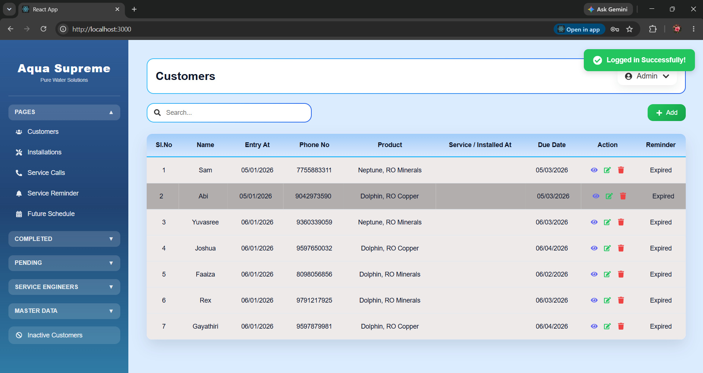
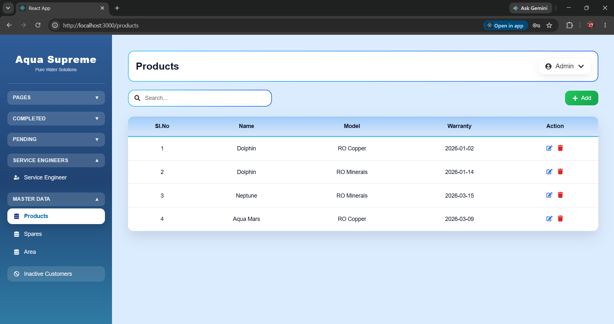
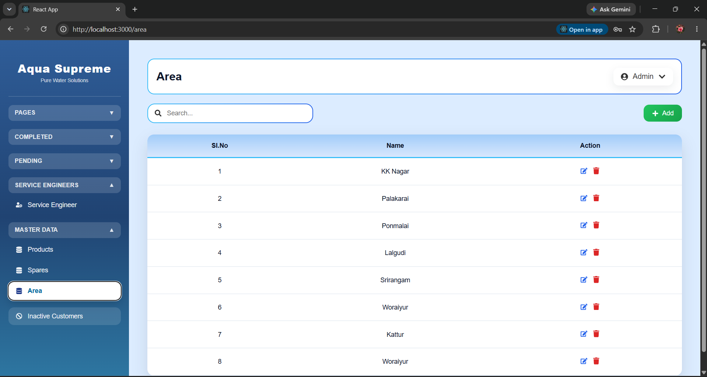
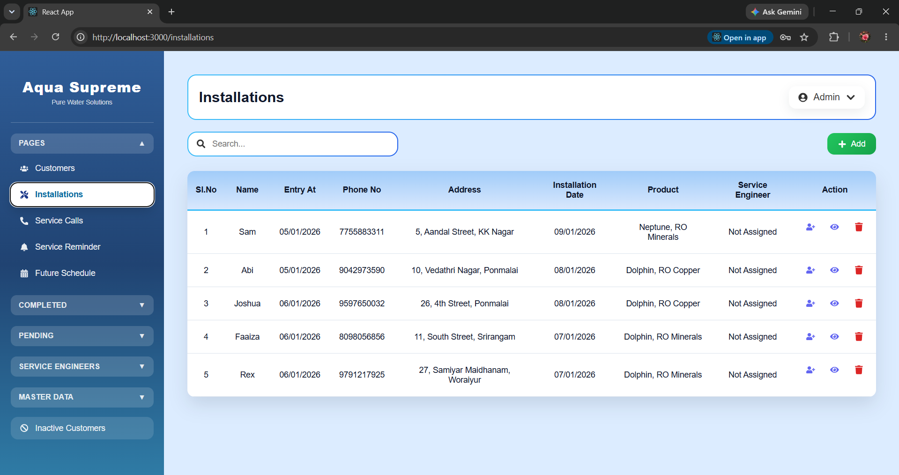
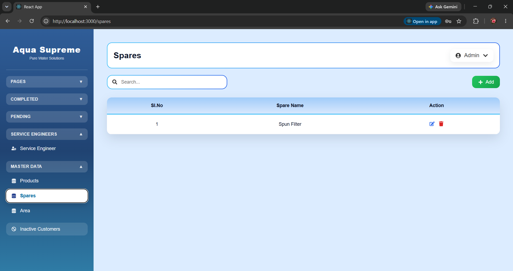

# Aqua Supreme RO Water App - UI Showcase

This repository showcases the UI design of the **Aqua Supreme RO Water App**, developed using **React.js, HTML, and CSS**.

> **Note:** This repository contains UI screenshots only. The source code is private.

## Technologies Used
- React.js
- HTML5
- CSS3

## Screenshots

### Login Page

### Customers

### Products

### Area

### Service Engineer

### Installations

### Installation Pending

### Installation Completed

### Service Calls

### Service Pending

### Service Completed

### Service Reminders

### Inactive Customers

### Future Schedule

### Spares

### Service Engineer - Installations

### Service Engineer - Installation Pending

### Service Engineer - Service Calls

### Service Engineer - Service Pending

